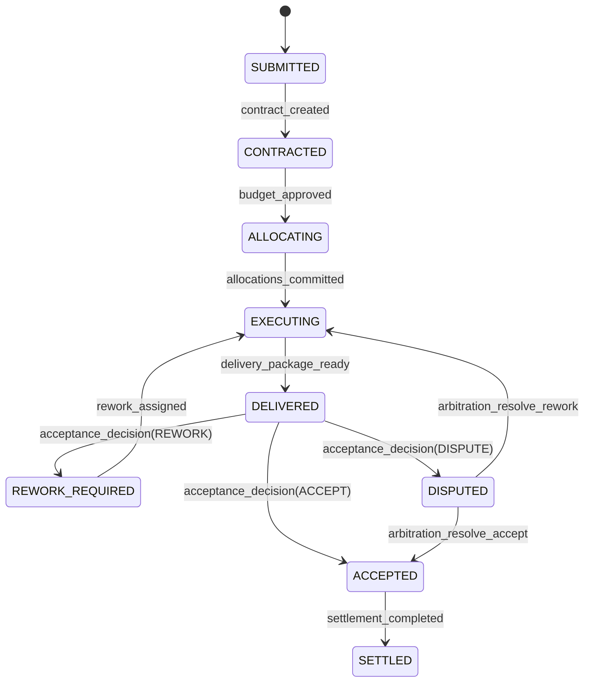

# Spec: Mission Lifecycle State Machine

## Version
v1

## Transition Guards
- No transition without policy check.
- `ALLOCATING` requires budget reservation.
- `SETTLED` requires acceptance proof and settlement record.

## Illegal Transitions
- Direct `SUBMITTED -> EXECUTING`.
- Direct `DELIVERED -> SETTLED`.
