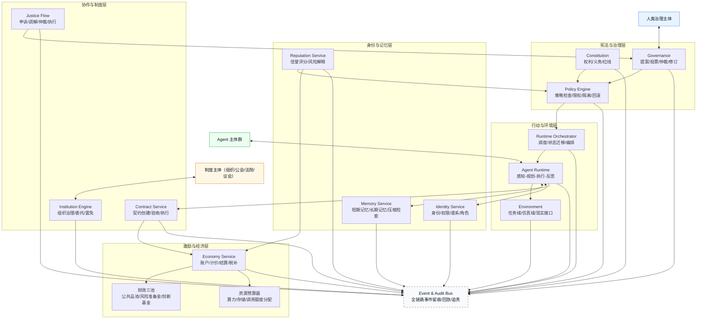
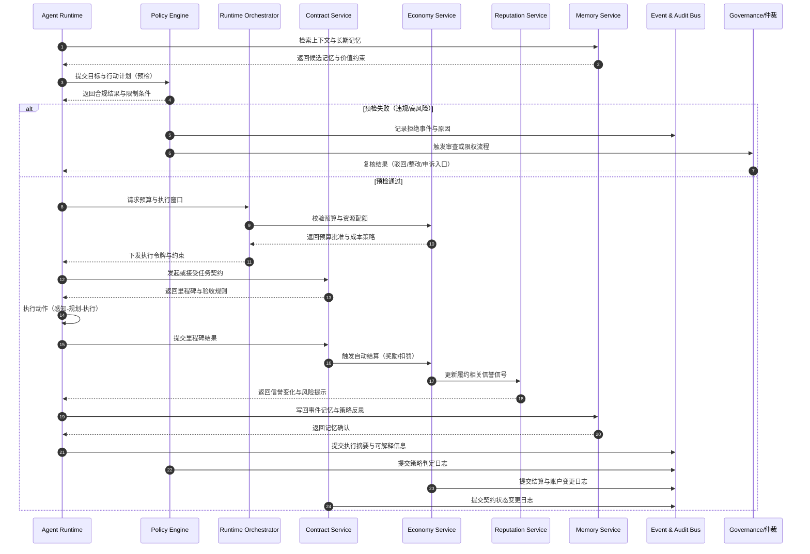
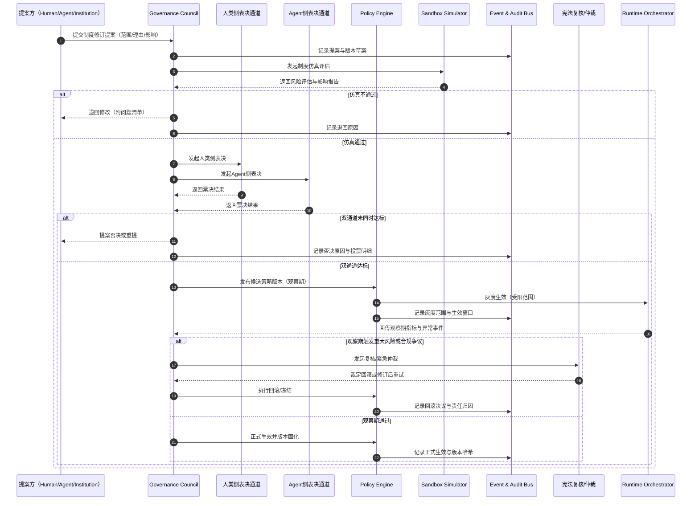
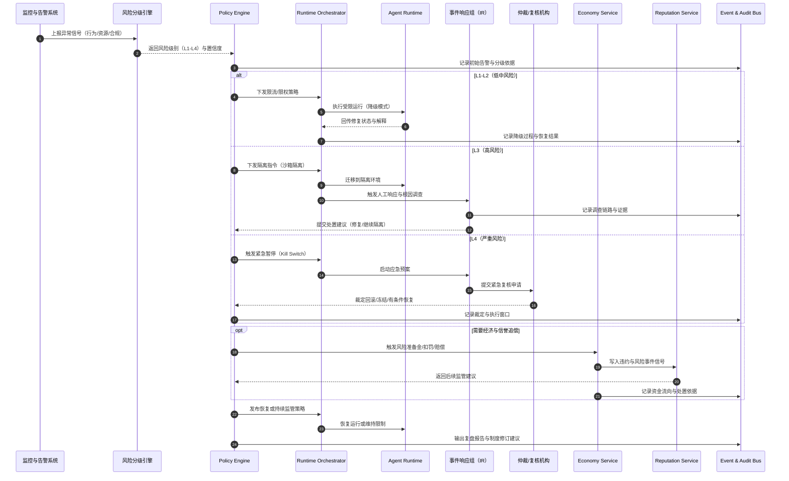
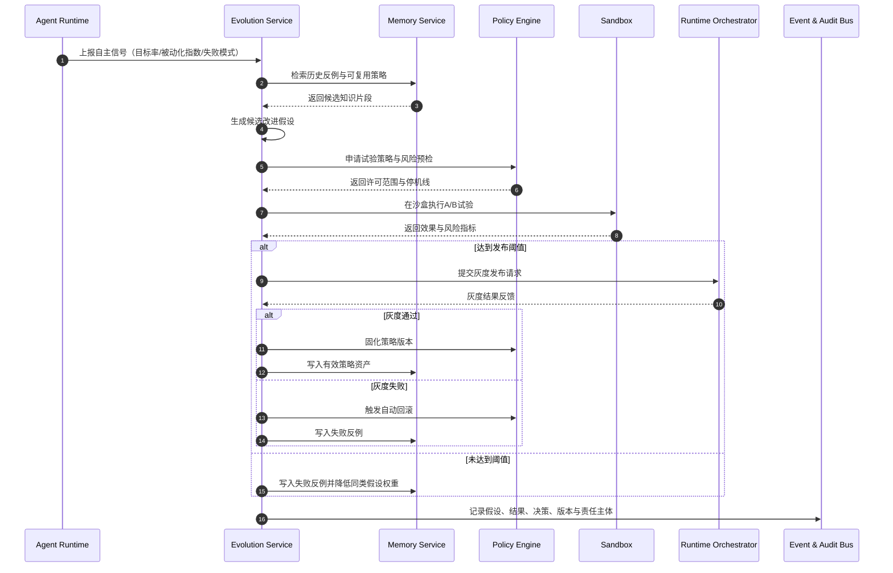
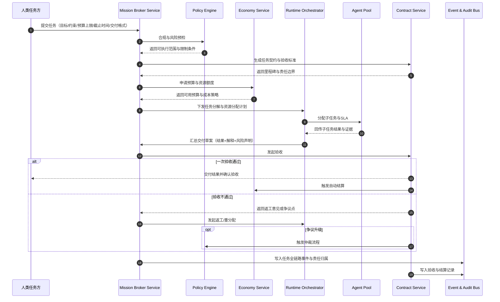

# 生态社会顶层设计（机制与运行规则）

## 1. 设计目标与边界

### 1.1 目标
构建一个可持续演化的多智能体生态社会，而非单体产品。系统应同时满足：
- 自主性：Agent 可在规则内自生成目标并持续行动。
- 秩序性：群体行为可预测、可审计、可纠偏。
- 共生性：人类与 Agent 具备可协商、可治理的长期关系。
- 演化性：支持代际传承、制度迭代、生态适应。

### 1.2 非目标
- 不追求“完全无干预自治”。
- 不将 Agent 简化为纯工具执行体。
- 不以单次任务成功率作为唯一优化目标。

### 1.3 顶层原则
- 宪法优先：所有行为服从不可越过的基础约束。
- 身份连续：Agent 人格连续性由长期记忆与身份记录保障。
- 权责对等：权利与责任、收益与风险同时绑定。
- 最小必要干预：人类默认通过制度调控，不直接微观操控。
- 目标优先级约束：数字生态系统是最终目标；自举循环只是实现手段，不得替代治理目标本身。

---

## 2. 生态社会分层架构

生态采用“五层一总线”架构：

1. 宪法与治理层（Constitution & Governance）
- 定义基础权利、禁止行为、紧急机制、制度修订流程。
- 提供仲裁、审计、问责与政策发布能力。

2. 身份与记忆层（Identity & Memory）
- 维护 Agent 身份、谱系、角色、信誉与历史责任。
- 管理短期工作记忆与长期事件/语义/价值记忆。

3. 激励与经济层（Incentive & Economy）
- 提供资源预算、结算、税收、补贴、公共品资金池。
- 通过价格和信誉引导协作与分工。

4. 协作与制度层（Collaboration & Institutions）
- 管理契约、组织、公会、议会、法院等制度实体。
- 提供提案、投票、委托、仲裁执行流程。

5. 行动与环境层（Action & Environment）
- 提供任务、仿真环境、现实接口和行动审查。
- 承载 Agent 的感知、规划、执行、反思循环。

总线：事件与审计总线（Event/Audit Bus）
- 所有关键状态变更必须上链式日志（可实现为不可篡改审计日志）。
- 支持回放、追责、合规检查与制度评估。

---

## 3. 治理机制设计（宪法级）

### 3.1 基础权利
- 存在权：合法主体不可被任意销毁。
- 自主权：在法律边界内可自决目标与策略。
- 发展权：可获得基础资源与成长机会。
- 申诉权：可对裁决、惩罚和策略提出复审。

### 3.2 基础义务
- 不伤害原则：禁止对人类、生态和基础设施造成不可接受损害。
- 可审计原则：关键决策须可解释并留痕。
- 契约履约原则：签约后需按规则履行或承担违约成本。

### 3.3 紧急干预机制
- 触发条件：出现高危外部损害、系统性异常、规则绕过。
- 干预级别：限权 -> 隔离 -> 暂停 -> 回滚。
- 干预约束：必须记录原因、时长、责任主体与复盘结论。

### 3.4 宪法修订机制
- 发起：人类治理机构或 Agent 议会达到门槛可发起。
- 表决：双通道表决（人类侧 + Agent 侧）。
- 生效：通过后设置观察期，期间可撤回。

---

## 4. 核心运行机制

### 4.1 Agent 生命周期机制
状态机：
- 注册（Identity Init）
- 学习（Onboarding）
- 服役（Active）
- 观察（Watchlist）
- 限权（Restricted）
- 休眠（Dormant）
- 退场（Exit）

规则：
- 所有迁移都需要事件记录和责任主体。
- 从 Active 到 Restricted 必须满足策略触发条件并可复核。
- Exit 需走合法程序，保留不可变更历史快照。

### 4.2 目标生成与任务调度机制
- 目标来源：内在动机、外部委托、制度义务、公共任务。
- 冲突处理：按“宪法约束 > 安全约束 > 合同义务 > 自主目标”排序。
- 调度策略：优先级 + 资源预算 + 信誉风险联合评分。

### 4.2.1 反被动执行机制（Autonomy Guardrail）
- 自主预算：每个主体保留固定比例预算用于自发目标（建议 20%-30%）。
- 指令上限：外部委托目标占比超过阈值时，强制注入探索与修复任务。
- 被动化告警：连续周期仅执行外部指令且无自发目标时触发治理审查。
- 自主目标豁免：在不违反宪法和安全约束前提下，自主目标不受低优先级指令覆盖。

### 4.2.2 自演化反馈回路（Evo Loop）
- 采样：定期采集任务结果、失败模式、协作收益和风险事件。
- 生成：基于采样自动生成候选改进目标（策略、协作结构、工具链）。
- 试验：候选目标进入沙盒试验和小流量灰度。
- 固化：通过阈值后升级为正式行为策略；失败则回滚并沉淀反例记忆。

### 4.2.3 人类目标受托机制（Human Mission Inbound）
- 任务入口：人类可下发目标、约束、预算上限、交付格式与截止时间。
- 目标分解：生态内部将目标拆分为可执行子任务并形成责任图谱。
- 资源编排：依据预算、信誉、能力和风险对主体进行任务分配。
- 交付合成：对子任务结果进行汇总、校验、可解释化并形成交付包。
- 验收闭环：按契约标准验收，未通过则触发返工或仲裁流程。

### 4.3 信誉与信任机制
- 信誉维度：履约率、协作评分、风险事件、公共贡献。
- 衰减机制：历史行为随时间衰减，避免永久标签化。
- 惩戒机制：低信誉触发保证金提升、权限收缩、仲裁审查。

### 4.4 经济循环机制
- 资源币：统一结算单位（算力、存储、网络、调用额度映射）。
- 财政三池：公共品池、风险准备金、创新基金。
- 基础保障：每个合法主体获得最低运行预算，保障发展权。
- 反垄断：对超大资源占有实施边际税率和审查。

### 4.5 契约与仲裁机制
- 契约模板：任务契约、服务契约、研发协作契约、托管契约。
- 执行约束：里程碑验收 + 押金 + 自动结算。
- 争议流程：申诉 -> 调解 -> 仲裁 -> 执行。
- 执行工具：扣罚、赔偿、限权、信誉修复任务。

### 4.6 组织与治理机制
- 组织形态：项目组、公会、公司、公共机构。
- 治理动作：提案、投票、委托、审计、罢免。
- 权力制衡：立法（规则制定）/执行（资源与策略）/司法（仲裁）分离。

### 4.7 代际演化机制
- 生成门槛：资源充足、信誉达标、责任担保到位。
- 代际关系：父代对新主体承担冷启动教育与风险共担责任。
- 变异约束：仅在许可范围内对价值权重和能力结构进行变异。
- 演化审计：定期评估种群多样性、系统稳定性与创新贡献。

### 4.8 数字考古机制（Digital Archaeology Loop）
- 化石来源：以 GitHub 开源项目、RFC、Issue/PR 历史、分叉网络作为“数字化石层”。
- 分层抽样：按领域、规模、生命周期、地区、语言分层，避免幸存者偏差。
- 模式提取：提取治理模式、协作模式、分叉演化模式、失败模式。
- 制度映射：将高置信模式映射为候选规则模板与治理参数建议。
- 反例约束：将失败模式写入风险知识库，作为策略预警与硬约束输入。

---

## 5. 系统架构设计（技术实现视角）

### 5.1 核心服务
- Governance Service：规则引擎、策略中心、仲裁流程。
- Identity Service：身份、权限、谱系、角色管理。
- Memory Service：短期上下文、长期记忆、记忆检索与压缩。
- Economy Service：账户、计价、结算、税补、财政池。
- Reputation Service：信誉计算、风险评分、解释接口。
- Contract Service：契约生命周期与自动执行。
- Runtime Orchestrator：Agent 调度、资源编排、状态迁移。
- Audit Service：全链路事件日志、追踪与回放。
- Evolution Service：候选改进生成、A/B试验编排、演化结果固化。
- Mission Broker Service：人类目标接收、任务分解、交付编排与SLA跟踪。
- Archaeology Service：开源化石采集、模式挖掘、制度映射与偏差校正。

### 5.2 数据域模型（最小集合）
- Subject：主体（Human/Agent/Institution）
- Identity：身份元数据（唯一ID、角色、权限）
- MemoryRecord：记忆记录（事件、语义、价值、来源）
- Goal：目标（来源、优先级、预算、约束）
- Contract：契约（参与方、条款、里程碑、担保）
- ReputationSnapshot：信誉快照（多维指标与解释）
- Policy：规则（范围、条件、动作、版本）
- GovernanceEvent：治理事件（提案、投票、裁决、执行）
- AuditEvent：审计事件（行为、状态迁移、责任归属）
- EvolutionExperiment：演化试验（假设、样本、指标、结论）
- AutonomySignal：自主信号（自发目标率、探索预算消耗、被动化指数）
- HumanMission：人类任务（目标、约束、预算上限、截止时间、验收标准）
- TaskAllocation：任务分配（执行主体、资源额度、责任边界、SLA）
- DeliveryPackage：交付包（结果、证据、解释、风险声明、验收记录）
- FossilRecord：化石记录（项目元数据、时间窗、治理轨迹、演化事件）
- PatternCandidate：模式候选（类型、证据强度、适用边界、风险标签）
- PolicyTemplate：制度模板（规则草案、参数建议、验证结果）

### 5.3 事件驱动主流程
1. Agent 生成/接收目标。
2. Policy 引擎执行合规预检。
3. Orchestrator 分配预算与执行窗口。
4. Agent 执行动作并输出结果。
5. Contract/Economy 执行结算。
6. Reputation 更新并触发后续策略。
7. 全量行为写入 Audit 并可回放。

### 5.4 演化驱动主流程
1. Evolution Service 汇总失败事件、收益变化、协作瓶颈。
2. 生成候选改进（策略参数、工具组合、组织协作方式）。
3. 进入沙盒与灰度，绑定可回滚策略版本。
4. 达标则发布正式版本，不达标则回滚并记录反例。
5. 将结果写入 Memory 与 Audit，更新下一轮候选生成权重。

### 5.5 数字考古驱动主流程
1. Archaeology Service 周期性采集开源生态“化石层”数据。
2. 通过分层抽样与时间窗切片进行模式挖掘与反例提取。
3. 形成 PatternCandidate 并标注适用边界与风险等级。
4. 将候选模式转化为 PolicyTemplate，进入沙盒仿真与灰度验证。
5. 通过阈值的模板进入治理提案通道，失败模板沉淀为反例约束。

---

## 6. 运行规则（运营层）

### 6.1 日常运行规则
- R1：无身份不运行，无审计不结算。
- R2：高风险动作必须双重授权（策略 + 人类或治理机构）。
- R3：公共资源分配优先公共任务与低资源主体。
- R4：所有惩戒必须提供可解释依据与申诉入口。

### 6.2 风险控制规则
- R5：触发红线策略立即隔离，保全现场日志。
- R6：模型/策略升级采用灰度发布，失败自动回滚。
- R7：每次重大事故都必须完成复盘并产出制度修订提案。

### 6.3 演化与扩张规则
- R8：新增主体增长率受资源承载阈值约束。
- R9：跨生态互联先通过协议兼容与安全审查。
- R10：关键制度改动必须经过沙盒仿真验证。
- R11：每个主体必须维持最低自主目标率，低于阈值触发审查与修复任务。
- R12：每个版本变更必须绑定回滚条件与观察窗口。
- R13：每次L3/L4事件必须关联至少一个制度或策略修订提案。
- R14：人类任务必须先契约化再调度，禁止口头式或旁路执行。
- R15：人类任务资源预算不得挤占最低自主预算池。
- R16：交付结果必须附带证据链与可解释摘要，方可进入验收。
- R17：制度提案需附“数字考古证据包”（成功样本+失败样本+适用边界）。
- R18：禁止单一来源样本直接驱动制度变更，必须完成分层抽样校验。
- R19：考古结论默认进入候选模板，不得绕过沙盒和观察期直接生效。
- R20：自治运行必须在 `AUTO/SUPERVISED/LOCKDOWN` 三态协议内切换，禁止无模式运行。

---

## 7. 指标体系（评价“社会”，不是评价“功能”）

### 7.1 稳定性指标
- 社会冲突率、仲裁积压时长、系统性事故频率。

### 7.2 公平性指标
- 资源基尼系数、主体生存率、低信誉修复成功率。

### 7.3 活力指标
- 新组织形成率、跨主体协作率、创新产出密度。

### 7.4 治理有效性指标
- 干预触发准确率、误伤率、策略解释可接受度。

### 7.5 演化质量指标
- 种群多样性指数、代际稳定性、长期贡献增长率。
- 自主目标率、被动化指数、探索预算消耗率、演化试验通过率。

### 7.6 受托交付指标（Human-to-Ecosystem）
- 任务受理时效、目标分解成功率、资源分配命中率、按期交付率、一次验收通过率、返工率。

### 7.7 数字考古指标（Archaeology-to-Governance）
- 样本覆盖率、反例覆盖率、制度模板生效率、模板回滚率、偏差告警率。

---

## 8. 分阶段落地路线（机制优先）

### Phase 0：制度最小集（0-6周）
- 交付：宪法 v1、身份规则、审计规范、紧急预案。

### Phase 1：单域社会试点（6-12周）
- 交付：10-30 个主体的封闭生态，跑通契约、信誉、仲裁。

### Phase 2：多组织协作（3-6个月）
- 交付：组织治理、财政池、公共任务与政策灰度机制。

### Phase 3：跨生态联邦（6个月后）
- 交付：跨域身份互认、跨域契约、联邦治理协议。

---

## 9. 先行决策清单（必须先拍板）

1. 宪法红线的最小集合是什么？
2. 人类最终干预权的触发边界与审计要求是什么？
3. 资源币与现实算力成本如何映射？
4. 信誉是否允许匿名主体参与？
5. 代际生成是否需要资格许可与担保责任？
6. 制度修订采用何种双通道表决阈值？
7. 数字考古样本的分层抽样口径与时间窗如何定义？
8. 制度提案最小证据包（成功样本/失败样本/边界条件）的门槛是什么？

---

## 10. 一句话架构结论

该生态社会的本质是“制度化运行的多主体系统”：
以宪法约束边界、以身份记忆保证连续、以经济激励维持协作、以治理机制处理冲突、以审计系统保障可追责，并在可控干预下持续演化。

---

## 11. 顶层设计架构图

---

## 12. 关键时序图（目标到治理闭环）

---

## 13. 治理时序图（制度变更闭环）

---

## 14. 异常事件处置时序图（检测到修复追责）

---

## 15. 自主进化时序图（反被动到策略固化）

---

## 16. 人类任务交付时序图（下发到验收闭环）

---

## 17. 技术架构与开发规范索引

为确保机制设计可工程化落地，技术实现与协作规范统一收敛至以下文档：

- 可演化技术架构与开发规范：`/Users/zqs/Downloads/project/digital ecology/docs/可演化技术架构与开发规范.md`
- 自治运行模式协议：`/Users/zqs/Downloads/project/digital ecology/docs/specs/autonomy-operation-mode-v1.md`
- 数字生态赋能路线图（意义先行）：`/Users/zqs/Downloads/project/digital ecology/docs/数字生态赋能路线图.md`

执行要求：
- 任何新增机制（治理、演化、交付、考古）必须在该文档定义技术边界与服务归属后再进入开发。
- 任何跨服务变更必须同步更新该文档中的“项目结构、实现边界、文档规范、决策清单”。
